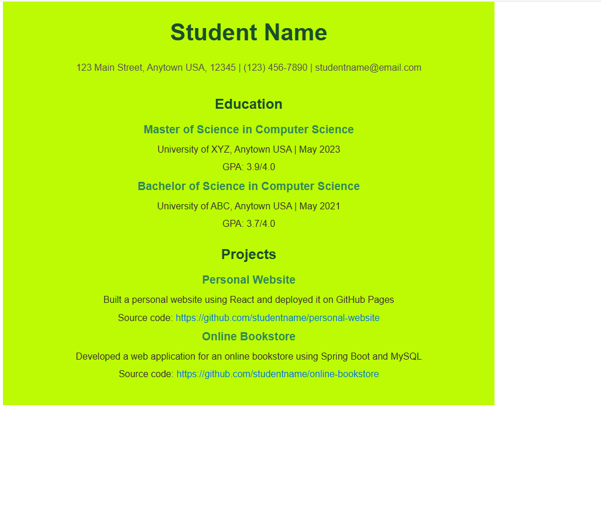

# cs628-PE-Honorine
This application is a recent web application of a resume. This app can be explained using the Input-Process-Output (IPO) model:

# Input 
Use "npx create-react-app" to create the client side. Create and configure Resume.js and Resume.css in the src directory. Styling is done in Resume.css with the background color being rgba(#bdfb04).

# Process
For the react component structure, Resume.js imports Resume.css and has the structured HTML-like JSX format. 
This data is rendered in semantic sections such as div, h1, p:This is done using React's component system.
React rendering is done by App.js integrating the Resume components. The browser then loads and renders the resume data.
In the command line rum "npm start" and it starts a development server, it then processes the React code using Webpack, which bundles it for a live rendering.

# Output
The output is a responsive, visually styled webpage that displays the user's resume as shown in the screenshot below:

